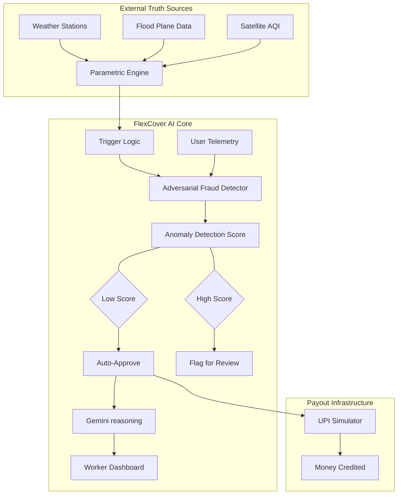

# 🛡️ FlexCover AI — Parametric Income Protection
> **Verifying reality before releasing money.**

FlexCover AI is a state-of-the-art parametric insurance platform built for the 10 million+ delivery partners in India's gig economy. It provides **zero-touch income protection** against external disruptions like extreme weather, floods, and pollution, ensuring that the backbone of the digital economy has a safety net when they need it most.

---

## 🚀 The Vision: Phase 3 "Scale & Optimise"
In this final phase, FlexCover has evolved from a simple trigger system into a **High-Fidelity Intelligence Platform**. We’ve integrated deep adversarial defenses and predictive analytics to ensure the system is resilient to fraud at scale while providing absolute transparency to workers.

### **Core Innovation Pillars**
1.  **Zero-Touch Parametric Claims**: Automated payout suggestions triggered by immutable weather station data (Rainfall, AQI, Heat, Floods).
2.  **Adversarial Defense Engine**: Multi-dimensional anomaly scoring that catches GPS spoofing, device clustering (fraud rings), and shared location footprints.
3.  **Gemini-Powered Transparency**: High-reasoning AI that explains *exactly* why a claim was approved or flagged, translating complex data into friendly worker-facing logic.
4.  **Predictive Risk Intelligence**: A 7-day forecasting engine that helps insurers manage reserves and helps workers anticipate income risks.

---

## 🛠️ Architecture: How it Works



---

## ✨ Key Features

### **For Workers (The Shield)**
-   **1-Tap Payouts**: No forms, no bills. Just one tap to receive money when weather stops work.
-   **AI Analysis**: Instant "Gemini reasoning" explaining every claim decision in plain language.
-   **Protection Gauge**: Real-time visualization of weekly earnings protected and active coverage limits.
-   **High-Fidelity UPI Simulator**: Experience the seamless flow of instant wage recovery.

### **For Insurers (The Brain)**
-   **Intelligence Hub**: Visualize "Adversarial Hotspots" where GPS spoofing or fraud rings are detected.
-   **Loss Ratio Analytics**: platform-wide visibility into financial health and payout volumes.
-   **Dynamic Risk Forecasting**: Predictive maintenance of premium pools based on upcoming weather trends.
-   **Fraud Ring Detection**: Detecting coordinated attacks sharing specific device/IP footprints.

---

## 💻 Tech Stack

-   **Frontend**: React 19, Vite, TailwindCSS 4, Recharts, Lucide Icons.
-   **Backend**: Node.js, Express, Concurrent server architecture.
-   **AI Engine**: Google Gemini 2.0 Flash (via `@google/generative-ai`).
-   **Styling**: Premium Glassmorphic UI with dynamic neon accents and custom micro-animations.

---

## 🚦 Getting Started

### **Prerequisites**
-   Node.js (v20 or higher)
-   npm or yarn
-   (Optional) Gemini API Key in `.env` for AI reasoning features.

### **Installation**
1. **Clone the Repo**
   ```bash
   git clone https://github.com/PiyushJaiswal620/FlexCover.git
   cd FlexCover
   ```

2. **Install Dependencies**
   ```bash
   npm install
   ```

3. **Environment Setup**
   Create a `.env` file in the root:
   ```env
   GEMINI_API_KEY=your_key_here
   PORT=3001
   ```

4. **Run the Full App**
   Execute both the frontend and backend simultaneously:
   ```bash
   npm run dev:full
   ```
   -   **Frontend**: `http://localhost:5173` (or 5174)
   -   **Backend**: `http://localhost:3001`

---

## 🛡️ Adversarial Defense Strategy

FlexCover doesn't just check location; it verifies **Environmental Truth**. 
-   **Spotting the Spoofer**: If a device reports a "Flood Claim" but the weather API shows 0mm rainfall at those coordinates, the Anomaly Score spikes.
-   **Catching the Ring**: Claims originating from the same device signature or IP cluster within a tight temporal window are instantly quarantined for admin review.
-   **Reputation Multiplier**: Long-term verified workers with consistent platform activity receive "Fast-Track" approval status.

---
> FlexCover AI: Scaling trust for the people who move our economy.
